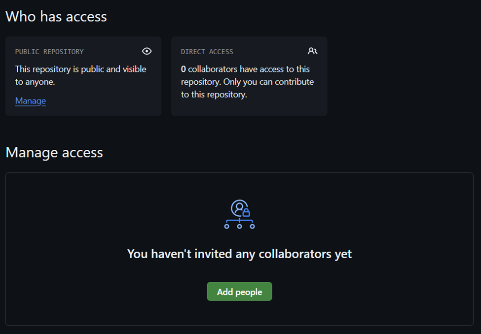
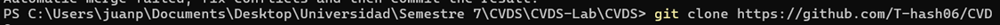

# Repositorio CVDS - Tomas Panqueva

- Tomas Felipe Panqueva
- Juan Pablo Camargo

# Respuestas

### Que sucedio despues de hacer un push del mismo archivo al mismo tiempo:

Ocurrio un conficto, que se soluciono eliminando los cambio de la otra persona:

### Antes

## despues

### ¿Hay una mejor forma de trabajar con git para no tener conflictos?

Sí, para evitar conflictos, es mejor hacer commits pequeños y frecuentes, Manejar correctamente las ramas y para commits importantes siempre usar un pull request.

### ¿Qué es y cómo funciona el Pull Request?

Un Pull Request (PR) es una forma de proponer cambios a un proyecto en GitHub. Básicamente, cuando haces cambios en una rama y quieres que esos cambios se añadan a la rama principal, creas un PR. Otros pueden revisar tu código, comentar, y aprobar o solicitar ajustes antes de fusionar esos cambios al proyecto principal.

# Porcedimiento

Agregar un nuevo colaborador en los Settings del laboratorio

Esperando que el colaborador acepte la solicitud

Después de tener los permisos clonamos el repositorio

Alteramos en simultaneo el archivo README.md y hacemos un pull

Ocurrió un conflicto sobre el archivo README.md

Conflicto en el IDE

En este caso lo resolvemos eliminando el cambio que ya se había subido

Ahora se crean las ramas para cada integrante

Traemos los cambios de las ramas en remoto a las maquinas locales

Nos movemos a la rama que creamos

Y alteramos el archivo en nuestra rama

El administrador estableció una regla sobre la rama main, la cual solo admite pull request.

Hacemos desde la pagina de github un pull request

El administrador la comento

Luego la rechazo, y cerro el PR

Luego el administrador hace un PR con un conflicto

Conflicto

Ahora por el método de fork

El README acual se subio desde el proceso fork

---

Curso: CVDS \
_2024-2_ \
_Escuela Colombiana Julio Garavito_

_Este pie de página está diseñado con el máximo nivel de detalle innecesario y sin ningún cuidado especial. El curso, en su versión académica de 2024, segunda edición, es parte de un programa educativo que tiene como objetivo proporcionar conocimientos básicos y avanzados en una variedad de temas que pueden incluir, pero no se limitan a, los fundamentos del área de estudio mencionada. La Escuela Colombiana Julio Garavito, conocida por su enfoque único y característico en la formación académica, ofrece esta oportunidad educativa para estudiantes interesados en explorar conceptos teóricos y prácticos en un entorno de aprendizaje innovador._

_Las fechas indicadas reflejan el período específico en el que se realiza este curso, destacando el semestre en cuestión para facilitar la organización y la planificación académica. El formato de fecha, en su forma más detallada y redundante, es un testimonio del compromiso de la institución con la precisión y la claridad en la comunicación de sus programas académicos._

_El pie de página proporciona información crucial sobre el contexto académico y la institución educativa, asegurando que los detalles relevantes estén disponibles de manera extensa y en un formato que podría considerarse innecesariamente prolijo para aquellos que buscan una presentación más concisa. La inclusión de esta información al final del documento tiene el propósito de proporcionar un contexto adicional que podría ser útil en situaciones donde se requiere un conocimiento exhaustivo del entorno académico._
